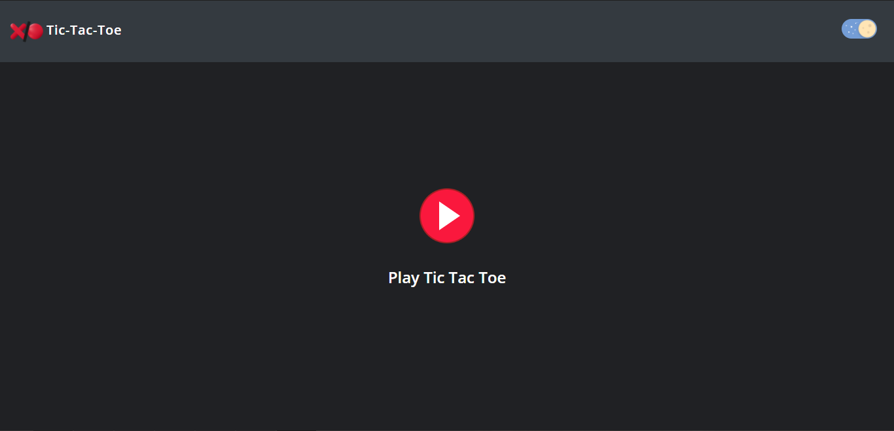
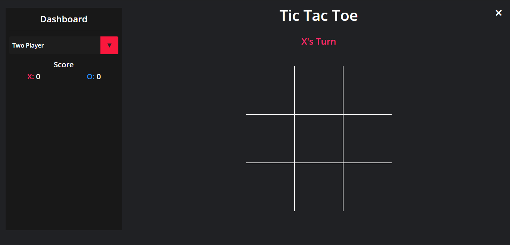
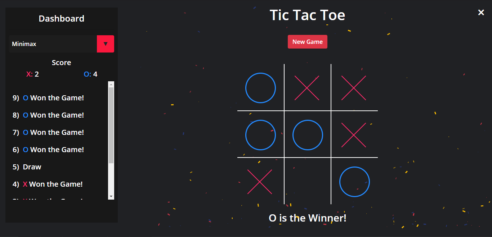

# Game VS IA - Tic-Tac-Toe Contra algoritmos de IA 😈
   
   

_Emilio Josafat Giacomo Quintero - Programación para Internet 2023B_

## Algoritmos de IA implementados
1. Minimax Algorithm
2. Alpha-Beta Pruning Algorithm
3. Hill Climbing Algorithm

## Comenzando 🚀

_Estas instrucciones te permitirán obtener una copia del proyecto en funcionamiento en tu máquina local para propósitos de desarrollo y pruebas._

Mira **Deployment** para conocer como desplegar el proyecto.

### Pre-requisitos 📋

1. Git Version Control (Download & Install)  
`https://git-scm.com/downloads`
2. Node JS (LTS) (Download & Install)  
`https://nodejs.org/en/download/`
3. Angular Latest Version (Run Command)  
`npm install -g @angular/cli@latest`
4. Nodemon - Optional (Run Command)  
`npm install -g nodemon`

## Development

1. Clone el repositorio ejecutando este comando donde desea guardar el proyecto.
`git clon https://github.com/Adoptsomekids/Game-VS-IA`
2. Instale los módulos de nodo.
i) En el **directorio raíz**, ejecute el comando:
`install npm`
ii) Vaya al directorio **'angular-src'** y ejecute nuevamente:
`install npm`
3. En el **directorio raíz**, ejecute el comando:
`nodemon` o `nodo app.js`
4. Vaya al directorio **'angular-src'** y ejecute el comando:
`ng servir`
5. Abra un navegador y vaya a la siguiente URL:
`localhost:4200`

## Despliegue 📦

_Deployment desde Railway o localhost_

_Selección de modo de juego (Single/Two Players/IA algortithms)_

_Resumen de marcador en tablero_

_Cambio de modo de color de ventana_

### Pruebas de estilo de codificación ⌨️

_App.js deployment & starting server_

_Seteo de barra de navegación_

## Construido con 🛠️

* [Railway](https://railway.app) -  Hosting platform
* [Visual Studio Code](https://code.visualstudio.com/) - Editor de Código
* [TypeScript](https://www.typescriptlang.org/) - Programming language
* [JavaScript](https://developer.mozilla.org/en-US/docs/Web/JavaScript) - Programming language
* [HTML](https://html.com/document/) - Programación web

## Autor ✒️

* **Emilio Josafat Giacomo Quintero** - *Desarrollo / Codificación* - [Adoptsomekids](https://github.com/Adoptsomekids)

---
⌨️ con ❤️ por [Adoptsomekids](https://github.com/Adoptsomekids) 😸

